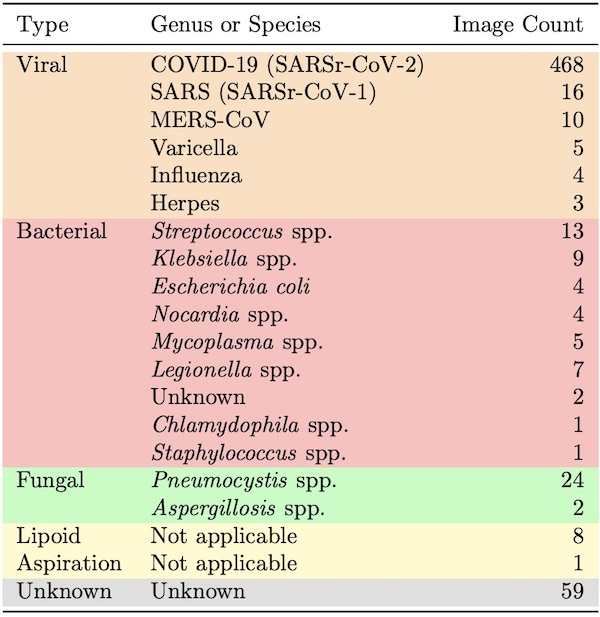

# Project Contents

## Table of Contents
- [Project Contents](#project-contents)
  * [Abstract (111 Words)](#abstract--111-words-)
  * [Background Information](#background-information)
    + [What is COVID-19?](#what-is-covid-19-)

## Abstract (111 Words)

This project is an attempt to develop a system that can classify lung X-ray images with an emphasis to detect X-ray images with COVID-19. In this project we will make use of image processing techniques learned in class and implement a classification system that can sort out the COVID-19 X-rays from the X-rays that are normal and have Pneumonia. This project will include image collection, image processing and image classification with the help of Deep neural networks namely CNN. As an aside we will also explore the performance of a machine learning model especially KNN. This project should yield a robust classifier that can help detect COVID-19 in a given image.

## Background Information

### What is COVID-19?
This is a virus which has been circulating the globe since 2019 . This virus is accompanied by symptoms like dry cough, fever, shortness of breath and a loss of smell and taste.This was considered as a respiratory virus. It is reported that most cases of this disease is mild and after running the full course of the virus most patients recover. However, severe course of this disease is pneumonia like and may result in death. In some cases also we see symptoms like headaches, aching limbs, sore throat and snifles. As a consequence of this disease, patients have experienced damages to their nerves and cardiovascular system. [1,2]

### Use of X Rays as an alternative to testing kits

When COVID-19 when was rampant, there was an increase in COVID-19 patients which strained the healthcare systems around the world. At the time when COVID-10 was at its peak, there were limited kits for diagnosis but also limited hospital beds, personal protective equipements and ventilators. Due to the sheer volume of the patients, it becames increasingly important to distinguish patients with severe acute respiratory illness(SARI) and COVID-19.Soon the world found itself using X-rays and devising tools with the help of it to classify X-rays. X-rays are not only cheap but are commonly found in various diagnostic settings. Also, they are well integrated into the digital infrastructure. Lastly, portable X-rays also allow for the creation of makeshift isolation wards reducin the need of PPE kits[2].

### Related Works

This idea is not a novel idea and there have many models and works surrounding X-rays. Most of these use machine learning and deep learning techniques coupled with image processing techniques that will help classify X-Ray images. The need of such systems was spurred on by the lack of healthcare professional to interpret the results. However, such systems are to be used for triaging  purposes [2].

Some works are:

Coronet[4], which is a Deep Convolutional Neural Network model to that automatically detects COVID-19 infection from chest X-ray images. The model the authors propsed is based on Xception architectures with its weights pre trained on ImageNet. Transfer learning is then done on the COVID-19 data set and pneumonia data sets which are publicly available. This model has achieved an overall accuracy of 89.6%. The model was experimented with 4 class classification scenarion(COVID,Pneumonia bacterial,Pneumonia viral,normal) and 3 class classification(COVID,Pneumonia,normal). The model achieved an overall accuracy of 89.6% and 95% respectively.

"Automated detection of COVID-19 cases using deep neural networks with X-ray images"[5], makes use of deep neural networks. However, the emodel so developed here was experimented for 2 class classification(COVID, No Findings) and 3 class classification(COVID, No findings, Pneumonia). The paper has implemented a DarkNet model that uses a you only look onece realtime object detection system and has achieved an accuracy of 98% for binary classification and 87% for multiclass classification.

COVID-NET[6], its the first open source network design for chest X-ray Images. In addition to this the study creates a database for COVID-19 against which we can bench mark our models and saves the trouble for creating the dataset. Transfer Learning approach was undertaken here where the COVID-NET model was first pretrained on Imagenet and then on the COVIDx dataset. 3 classes was used for classification and a comparison was done against other pretrained models like ResNET-50 and VGG-10 and COVID-NET was found to perform better than these models. The number of parameters and mathematical operation used in COVID-NET was less compared to ResNET-50 and VGG-19.

## Implemented Method

In our project we will have the following tasks:

### Data Collection:

For our project we will be collecting data from 2 data sources:

1. [Covid 19 X-Ray DataSet](https://github.com/ieee8023/covid-chestxray-dataset) [7]
2. [Bacterial and Viral Pneumonia](https://www.kaggle.com/paultimothymooney/chest-xray-pneumonia)

#### [Covid 19 X-Ray DataSet](https://github.com/ieee8023/covid-chestxray-dataset)

This data has the following distribution illustrated in the following image:

From this data set we take images that are labelled as COVID and the X-ray image is in the anteroposterior (AP) or in the anteroposterior supine position(AP Supine).

The COVID images were stored in the following formats:

## References
- [1]. ist COVID, W. What is COVID-19?.
- [2]. Mangal, A., Kalia, S., Rajgopal, H., Rangarajan, K., Namboodiri, V., Banerjee, S., & Arora, C. (2020). CovidAID: COVID-19 detection using chest X-ray. arXiv preprint arXiv:2004.09803.
- [3]. Narin, A., Kaya, C., & Pamuk, Z. (2021). Automatic detection of coronavirus disease (covid-19) using x-ray images and deep convolutional neural networks. Pattern Analysis and Applications, 24, 1207-1220.
- [4]. Khan, A. I., Shah, J. L., & Bhat, M. M. (2020). CoroNet: A deep neural network for detection and diagnosis of COVID-19 from chest x-ray images. Computer methods and programs in biomedicine, 196, 105581.
- [5]. Ozturk, T., Talo, M., Yildirim, E. A., Baloglu, U. B., Yildirim, O., & Acharya, U. R. (2020). Automated detection of COVID-19 cases using deep neural networks with X-ray images. Computers in biology and medicine, 121, 103792.
- [6]. Wang, L., Lin, Z. Q., & Wong, A. (2020). Covid-net: A tailored deep convolutional neural network design for detection of covid-19 cases from chest x-ray images. Scientific reports, 10(1), 19549.
- [7]. Cohen, J. P., Morrison, P., & Dao, L. (2020). COVID-19 image data collection. arXiv preprint arXiv:2003.11597.
