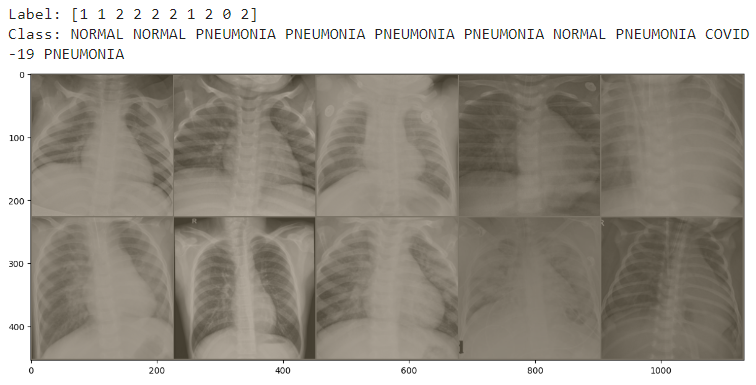

# Project Contents

## Table of Contents
- [Project Contents](#project-contents)
  * [Abstract (111 Words)](#abstract--111-words-)
  * [Background Information](#background-information)
    + [What is COVID-19?](#what-is-covid-19-)

## Abstract (111 Words)

This project is an attempt to develop a system that can classify lung X-ray images with an emphasis to detect X-ray images with COVID-19. In this project we will make use of image processing techniques learned in class and implement a classification system that can sort out the COVID-19 X-rays from the X-rays that are normal and have Pneumonia. This project will include image collection, image processing and image classification with the help of Deep neural networks namely CNN. As an aside we will also explore the performance of a machine learning model especially KNN. This project should yield a robust classifier that can help detect COVID-19 in a given image.


## Background Information

### What is COVID-19?
This is a virus which has been circulating the globe since 2019 . This virus is accompanied by symptoms like dry cough, fever, shortness of breath and a loss of smell and taste.This was considered as a respiratory virus. It is reported that most cases of this disease is mild and after running the full course of the virus most patients recover. However, severe course of this disease is pneumonia like and may result in death. In some cases also we see symptoms like headaches, aching limbs, sore throat and snifles. As a consequence of this disease, patients have experienced damages to their nerves and cardiovascular system. [1,2]

### Use of X Rays as an alternative to testing kits

When COVID-19 when was rampant, there was an increase in COVID-19 patients which strained the healthcare systems around the world. At the time when COVID-10 was at its peak, there were limited kits for diagnosis but also limited hospital beds, personal protective equipements and ventilators. Due to the sheer volume of the patients, it becames increasingly important to distinguish patients with severe acute respiratory illness(SARI) and COVID-19.Soon the world found itself using X-rays and devising tools with the help of it to classify X-rays. X-rays are not only cheap but are commonly found in various diagnostic settings. Also, they are well integrated into the digital infrastructure. Lastly, portable X-rays also allow for the creation of makeshift isolation wards reducin the need of PPE kits[2].

### Related Works

This idea is not a novel idea and there have many models and works surrounding X-rays. Most of these use machine learning and deep learning techniques coupled with image processing techniques that will help classify X-Ray images. The need of such systems was spurred on by the lack of healthcare professional to interpret the results. However, such systems are to be used for triaging  purposes [2].

Some works are:

Coronet[4], which is a Deep Convolutional Neural Network model to that automatically detects COVID-19 infection from chest X-ray images. The model the authors propsed is based on Xception architectures with its weights pre trained on ImageNet. Transfer learning is then done on the COVID-19 data set and pneumonia data sets which are publicly available. This model has achieved an overall accuracy of 89.6%. The model was experimented with 4 class classification scenarion(COVID,Pneumonia bacterial,Pneumonia viral,normal) and 3 class classification(COVID,Pneumonia,normal). The model achieved an overall accuracy of 89.6% and 95% respectively.

"Automated detection of COVID-19 cases using deep neural networks with X-ray images"[5], makes use of deep neural networks. However, the emodel so developed here was experimented for 2 class classification(COVID, No Findings) and 3 class classification(COVID, No findings, Pneumonia). The paper has implemented a DarkNet model that uses a you only look onece realtime object detection system and has achieved an accuracy of 98% for binary classification and 87% for multiclass classification.

COVID-NET[10], its the first open source network design for chest X-ray Images. In addition to this the study creates a database for COVID-19 against which we can bench mark our models and saves the trouble for creating the dataset. Transfer Learning approach was undertaken here where the COVID-NET model was first pretrained on Imagenet and then on the COVIDx dataset. 3 classes was used for classification and a comparison was done against other pretrained models like ResNET-50 and VGG-10 and COVID-NET was found to perform better than these models. The number of parameters and mathematical operation used in COVID-NET was less compared to ResNET-50 and VGG-19.

## Implemented Method

In our project we will have the following tasks:

### Data Collection:

For our project we will be collecting data from 2 data sources:

1. [Covid 19 X-Ray DataSet](https://github.com/ieee8023/covid-chestxray-dataset) [11]
2. [Bacterial and Viral Pneumonia](https://www.kaggle.com/paultimothymooney/chest-xray-pneumonia)

#### [Covid 19 X-Ray DataSet](https://github.com/ieee8023/covid-chestxray-dataset)

This data has the following distribution illustrated in the following image:


From this data set we take images that are labelled as COVID and the X-ray image is in the anteroposterior (AP) or in the anteroposterior supine position(AP Supine).

The COVID images were stored in the following formats:


The COVID images that we have filtered does not have `.gz` files.

#### [Bacterial and Viral Pneumonia](https://www.kaggle.com/paultimothymooney/chest-xray-pneumonia)

In this data set we have a collection of chest X-rays that are either annotated as Pneumonia or Normal. Most of the images present in this dataset are in the AP position only. Pneumonia has about 4273 occurrences in the dataset where as normal chest X-Rays has about 1583 ocurrences.

After combining all the data our final data distribution looks something like this.


### Data Preparation

After collecting the data we need to ensure that images are copied to a new directory where they have the following structure:

```
my_data
|-test
|-train
|-val
   |-COVID-19
   |-NORMAL
   |-PNEUMONIA
```
20% of the dataset is reserved for testing and 20% of the training data is used for validation.

We perform the following transformations on the images:

1. GrayScale Conversion - All the images have the same number of channels, i.e. all the images should either be in RGB or grayscale. For this project we are going to convert all images to grayscale.
2. Resize - All the images have the same dimensions i.e. 224x224
3. Center Crop - Crops a given image at the center
4. Normalize - Normalize a given image with mean = 0.5 and standard deviation = 0.5

After doing the aformentioned processes our images look something like this



Optionally we also use Fourier Transform, to see whether we can improve the results.


### Building our model

#### CNN
In this project, rather than use a pretrained model, we built our own CNN Model. Our CNN model architecture is as follows:
1. Input Convulation layer: This layer has a width of 224 and height of 224 and is composed a single channel and is processed through the convolution layer witha filter size of 7 and stride of 4. 16 filters are used here. Our output dimensions here are 55x55x16
2. 1st Hidden Convulation layer: The output dimensions in the previous layer serves as the input here. We have 32 filters in this layer with a filter size of 5 and stride of 2. Our output dimensions are then 26x26x32
3. 1st Max Pooling Layer: The output of the previous layer is then subject to maxpooling where the kernel size is 3 and stride is 2. The out put dimensions here are 12x12x32
4. First Batch Normalisation layer: Batch Normalisation is performed here to speed up the learning process. Output dimensions are the same as the input dimensions.
5. 2nd Hidden Convolution layer: The input size here is 12x12x32 which then undergoes convolution through 64 filters with kernel size of 3 and stride of 1. The output dimension here then would be 10x10x64
6. 3rd Hidden Convolution layer: The input size is 10x10x64 which then undergoes convolution through 128 filters of kernel size 3 with a stride of 1. The output dimension here would then be 8x8x128
7. 2nd Max Pool layer: The input size is 8x8x128 which undergoes max pooling against kernel of size 3 with stride 1. The output dimension produced here is 6x6x128
8. 2nd Batch Normalisation layer: Batch Normalisation is performed here to speed up the learning process. Output dimensions are the same as the input dimensions.
9. Flatten Layer: The output of the Batch Normalisation layer is then flattened so that the dimensions are 1x4608
10. 1st Hidden Fully Connected Layer: The input size here is 1x4608 and the output size here 1x100. 
11. 1st Dropout layer: The dropout percentage is 50%
12. 2nd Hidden Fully Connected Layer: The input size here is 1x100 and the output size here is 1x50.
13. 2nd Dropout layer: The dropout percentage is 50%
14. Output layer: This is a fully connected layer whose input size is 1x50 and output is 1x3.

The activation used throughout except in the output layer is ReLU.

### Training

#### CNN

We run the training for the CNN model we have designed for about 30 epochs, but the model doesn't necessary train for 30 epochs since we add an early stopping condition i.e. training is stopped as soon as validation loss exceeds the training loss. In addition to early stopping we have dropout layers in place which prevent overfitting.

##### Training History


##### Training History with Fourier Images


## Evaluation of the Work

The following summarises the results we have obtained:

|  | Precision | Recall | F1-Score | Support |
| ---------| --------- | ------ | -------- | ------ |
| COVID     | 0.80    | 0.87 |     0.83     | 52   |
| Normal   | 0.78    |  0.98 |    0.86 |   252     |
| Pneumonia |  0.99   |   0.91  | 0.95 |    924    |
| Accuracy |        |          |   0.93    |         1228  |
| Macro Avg |  0.86  | 0.92 |0.88 |        1228  |
| Weighted Avg     |    0.94    |    0.93  |   0.93  |          1228     |

Confusion Matrix:

| | COVID | Normal | Pneumonia |
| --- | --- | --- | --- |
| COVID |  45  |  2 | 5  |
| Normal | 1 | 246    | 5  |
| Pneumonia | 10  | 69 | 845  |


## References
- [1]. ist COVID, W. What is COVID-19?.
- [2]. Mangal, A., Kalia, S., Rajgopal, H., Rangarajan, K., Namboodiri, V., Banerjee, S., & Arora, C. (2020). CovidAID: COVID-19 detection using chest X-ray. arXiv preprint arXiv:2004.09803.
- [3]. Narin, A., Kaya, C., & Pamuk, Z. (2021). Automatic detection of coronavirus disease (covid-19) using x-ray images and deep convolutional neural networks. Pattern Analysis and Applications, 24, 1207-1220.
- [4]. Khan, A. I., Shah, J. L., & Bhat, M. M. (2020). CoroNet: A deep neural network for detection and diagnosis of COVID-19 from chest x-ray images. Computer methods and programs in biomedicine, 196, 105581.
- [5]. Ozturk, T., Talo, M., Yildirim, E. A., Baloglu, U. B., Yildirim, O., & Acharya, U. R. (2020). Automated detection of COVID-19 cases using deep neural networks with X-ray images. Computers in biology and medicine, 121, 103792.
- [10]. Wang, L., Lin, Z. Q., & Wong, A. (2020). Covid-net: A tailored deep convolutional neural network design for detection of covid-19 cases from chest x-ray images. Scientific reports, 10(1), 19549.
- [11]. Cohen, J. P., Morrison, P., & Dao, L. (2020). COVID-19 image data collection. arXiv preprint arXiv:2003.11597.
